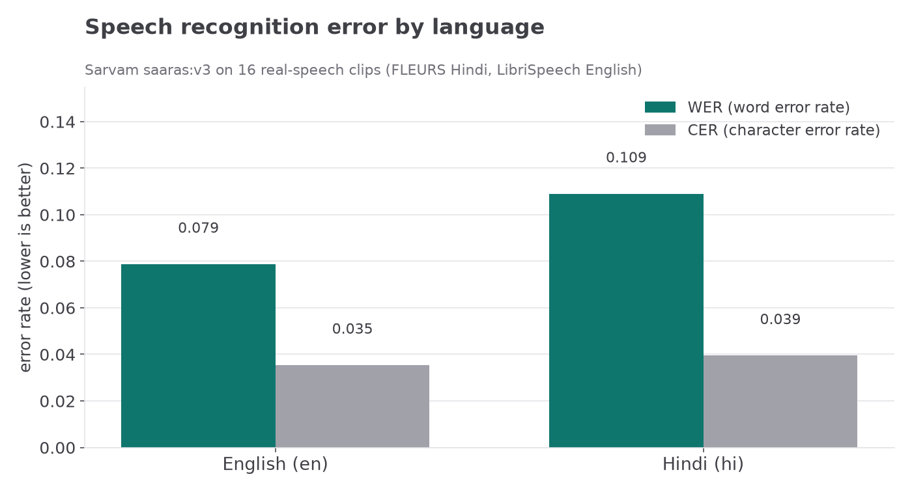

# sarvam-asr-benchmark

A small, reproducible **ASR evaluation harness for Indian-language speech** —
micro-averaged **WER / CER broken down by language × domain**, with pluggable
transcription providers (offline mock, Sarvam AI platform API, local
Whisper) and zero required dependencies.

Built because Sarvam AI published *"Evaluating Indian Language ASR"* and
hires for evaluation work: this repo is a working answer to the question
*"how would you measure whether an ASR model is good for Marathi
code-mixed speech?"* — with the harness, the metric definitions and the
reporting already in place.

---

## Quickstart (no install, no network, no API key)

```bash
python3 scripts/make_sample_audio.py      # placeholder clips for the sample set
PYTHONPATH=src python3 -m unittest discover -s tests -v   # 55 tests
PYTHONPATH=src python3 -m asrbench run --out results --quiet
```

That last command prints (real output, captured from this repo):

```text
## ASR benchmark — provider: mock

| Language | Domain | Provider | Utterances | Words | WER | CER |
| --- | --- | --- | ---: | ---: | ---: | ---: |
| en | broadcast | mock | 1 | 8 | 0.375 | 0.383 |
| en | code-mixed | mock | 1 | 8 | 0.375 | 0.312 |
| en | conversational | mock | 1 | 9 | 0.222 | 0.179 |
| en | read-speech | mock | 1 | 10 | 0.100 | 0.082 |
| hi | broadcast | mock | 1 | 8 | 0.375 | 0.250 |
| hi | code-mixed | mock | 1 | 10 | 0.100 | 0.025 |
| hi | conversational | mock | 1 | 10 | 0.200 | 0.121 |
| hi | read-speech | mock | 2 | 22 | 0.182 | 0.057 |
| hi | telephony | mock | 1 | 8 | 0.250 | 0.219 |
| mr | code-mixed | mock | 1 | 9 | 0.111 | 0.054 |
| mr | conversational | mock | 1 | 7 | 0.429 | 0.275 |
| mr | read-speech | mock | 2 | 14 | 0.429 | 0.172 |
| all | all | mock | 14 | 123 | 0.252 | 0.162 |

wrote results/results.csv
wrote results/report.md
```

> **These numbers are synthetic.** `mock` never opens an audio file — it
> applies a seeded corruption to each reference transcript to exercise the
> pipeline end-to-end without keys or GPUs. Real measurements come from the
> `sarvam` and `whisper` providers below. The table above exists to prove the
> harness runs, not to claim anything about model quality.

---

## Providers

| `--provider` | What it does | Requirements |
| --- | --- | --- |
| `mock` (default) | Seeded, deterministic transcript corruption — pipeline check | nothing (stdlib only) |
| `sarvam` | Sarvam AI platform ASR (`saaras:v3`) | `SARVAM_API_KEY` + `pip install requests` |
| `whisper` | Local `faster-whisper` baseline for comparison | `pip install faster-whisper` |

```bash
# real run against the Sarvam platform
cp .env.example .env      # fill in SARVAM_API_KEY  (never committed)
PYTHONPATH=src python3 -m asrbench run --provider sarvam --languages hi,mr --out results/sarvam

# comparison arm
PYTHONPATH=src python3 -m asrbench run --provider whisper --model small --out results/whisper
```

The endpoint path, form fields and `language_code` tags were verified live
against `https://api.sarvam.ai/speech-to-text` on 2026-10-03 — 30 requests
across two runs, all HTTP 200, `hi`/`mr`/`en` tags accepted, model
`saaras:v3` (`saarika:v2` was retired by the API itself). Base URL and path
stay overridable via `SARVAM_API_BASE` / `SARVAM_ASR_PATH` in case the API
moves; re-check `https://api.sarvam.ai/docs`. The key itself is never
stored in this repo.

## Live results — Sarvam `saaras:v3` on real speech (2026-10-03)

16 bundled real-speech clips (FLEURS Hindi + LibriSpeech English), one live
run against the platform:

| Language | Dataset | Clips | Words | WER | CER |
| --- | --- | ---: | ---: | ---: | ---: |
| hi | FLEURS `hi_in` validation | 6 | 156 | 0.109 | 0.039 |
| en | LibriSpeech `dev-clean` dummy | 10 | 254 | 0.079 | 0.035 |
| **all** | | **16** | **410** | **0.090** | **0.037** |



Reproduce with one command (needs a Sarvam key, ~30 seconds):

```bash
SARVAM_API_KEY=... PYTHONPATH=src python3 -m asrbench run \
  --manifest data/real/manifest.csv --provider sarvam --out results/live
```

Read this table as what it is: **an integration measurement, not a
leaderboard claim** — n = 16, read-speech only, a single run, no confidence
intervals. Clips are bundled under [`data/real/audio/`](data/real/) with
provenance and licence (both CC-BY 4.0, fetched 2026-10-03). A separate
live pass over the 14 placeholder-tone clips went 14/14 (Marathi included):
tones yield empty hypotheses and WER = 1.0 by construction, which is what a
no-speech input *should* produce.

## Getting real data

A real manifest is already bundled —
[`data/real/manifest.csv`](data/real/manifest.csv), 16 clips with
provenance documented in [`data/real/README.md`](data/real/README.md).
The 14-utterance sample set (hi/mr/en, 5 domains) stays *placeholder tones*
on purpose: it proves the harness offline without keys. To build another
real manifest:

1. Download labelled speech: [FLEURS](https://huggingface.co/datasets/google/fleurs)
   (`hi_in`, `mr_in`) or [Common Voice](https://commonvoice.mozilla.org/)
   (`hi`, `mr`). Practical note from building this repo: FLEURS's `train`
   split exceeds the Hugging Face datasets-server 300 MB scan limit — the
   `hi_in` / `en_in` **validation** splits serve fine.
2. Export a manifest in the same shape — one row per clip:
   `utt_id,audio_path,language,domain,dataset,reference`
3. Run the same command with `--manifest /path/to/manifest.csv`.

Nothing else changes: metrics, aggregation and reporting are
dataset-agnostic.

## Metric definitions

- **WER** = `edit_distance(ref_words, hyp_words) / len(ref_words)` — Levenshtein
  at word level; **can exceed 1.0** when the hypothesis contains insertions.
  Corpus numbers are **micro-averaged** (Σedits / Σreference tokens), the
  standard for ASR reporting.
- **CER** = same, at character level with spaces removed (comparable across
  languages that don't always space-separate words).
- **Normalisation** is Unicode-category based, deliberately: Python's `\w`
  regex excludes combining marks, so the usual `[^\w\s]` "strip punctuation"
  trick silently deletes Devanagari matras and viramas
  (`नमस्ते` → `नमस त`), corrupting every Hindi/Marathi score. A regression
  test (`test_devanagari_matras_and_viramas_preserved`) pins this down.

## Repository layout

```text
data/sample/manifest.csv     14 labelled utterances (hi/mr/en, 5 domains)
data/real/                   16 real clips (FLEURS hi + LibriSpeech en)
scripts/make_sample_audio.py placeholder clip generator
src/asrbench/
  textnorm.py                category-based normalisation
  metrics.py                 WER / CER / edit distance (stdlib)
  manifest.py                CSV manifest loading + validation
  report.py                  micro-aggregation, CSV + markdown reports
  cli.py                     `python3 -m asrbench {run,report}`
  providers/                 mock · sarvam API · local whisper
tests/                       55 unittest tests (offline)
results/                     generated (default outputs gitignored;
                             the two live-run snapshots are committed)
```

## Limits, honestly

- The bundled 14-clip sample set is placeholder tones — it proves the
  *harness*, not model quality (its live WER of 1.0 is the expected result
  for no-speech input, not a measurement).
- Live numbers exist for **hi/en only** (n = 16, read-speech, single run):
  Marathi has no openly accessible eval audio yet — FLEURS `mr_in` row
  groups exceed the datasets-server scan limit and Common Voice downloads
  are gated. The Marathi path is exercised by the tone run and the mock
  suite instead.
- `report` groups by language × domain only; speaker/gender stratification
  would need manifest columns.

## Roadmap

- [ ] Whisper-vs-Sarvam table on the same `data/real` manifest
- [ ] Marathi real-speech manifest (Common Voice download) + larger n
- [ ] Confidence intervals (bootstrap) on WER
- [ ] Code-mixed slice metrics (word-level script detection: Devanagari vs Latin)
- [ ] Sign-error / latency columns for the platform API

## License

MIT — see [LICENSE](LICENSE).
